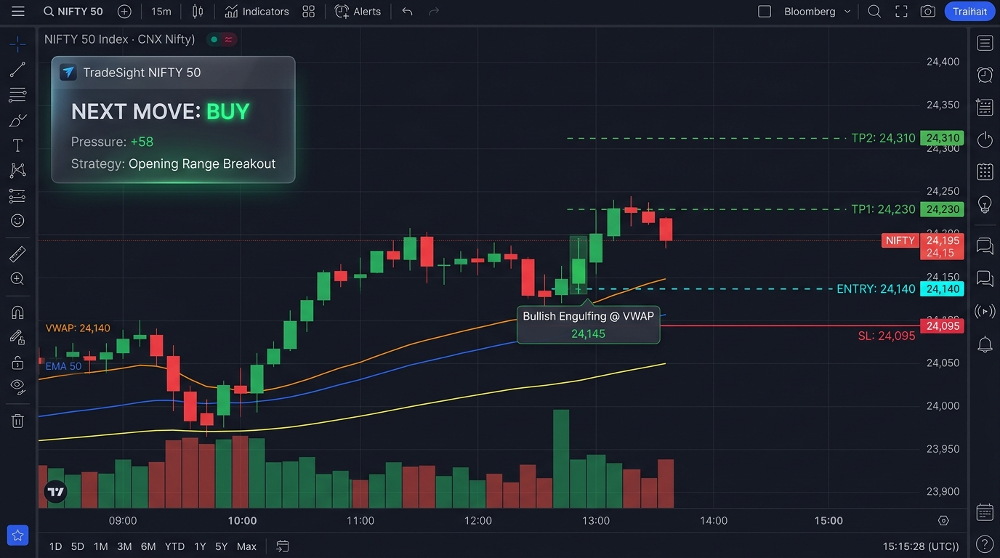
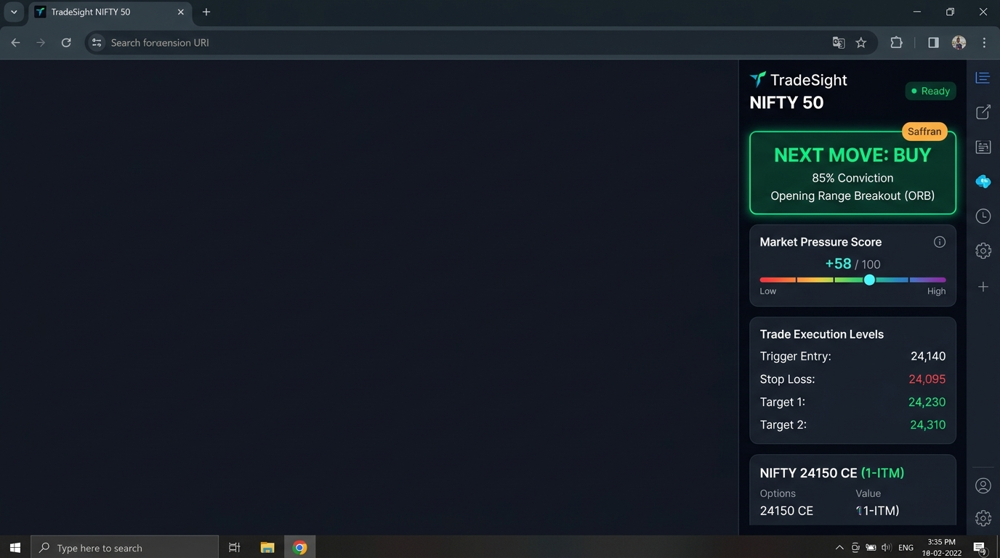

# TradeSight AI — Dedicated NIFTY 50 Institutional Engine

> **30-Year Veteran Indian Index Trader & Chrome Extension Engine (Manifest V3)**  
> Engineered exclusively for **NSE: NIFTY 50** (spot, futures, and weekly/monthly options). Continuous chart reading, mathematical pattern recognition, market driver synthesis (India VIX & cross-assets), and live on-chart NEXT MOVE (`BUY` / `SELL` / `WAIT`) signals.

---

## 📸 Extension Visual Previews

### 1. Injected TradingView Chart Overlay & Live Institutional HUD


### 2. Side Panel Interface — Next Move & Market Pressure Score


---

## 🏛️ Architecture Overview & Folder Structure

```
c:\Mohit\Forex_Extension\
├── manifest.json                        # Manifest V3 declaration
├── config/
│   └── nifty-config.js                  # Master thresholds (VIX, IST market hours, Nifty lot size)
├── patterns/
│   └── pattern-engine.js                # Deterministic pattern detection (Single, Two, Three-candle)
├── drivers/
│   └── driver-engine.js                 # 9 market drivers & Market Pressure Score (-100 to +100)
├── strategies/
│   └── strategy-engine.js               # 7 Nifty strategies, regime classifier & no-trade filters
├── overlay/
│   └── nifty-overlay.js                 # TradingView on-chart live HUD, level projection & audio alerts
├── journal/
│   └── nifty-journal.js                 # Verified trade journal & historical candle backtesting simulator
├── content/
│   ├── chart-detector.js                # TradingView DOM extractor (Nifty symbol, interval, live price)
│   ├── overlay-renderer.js              # Injected SVG drawing canvas & non-repainting level plots
│   └── overlay.css                      # Injected HUD & non-Nifty warning styling
├── ui/
│   ├── sidepanel.html                   # 5-Tab Institutional Terminal (Next Move, Drivers, Strategies, Journal, Config)
│   ├── sidepanel.css                    # Bloomberg/TradingView dark theme with pressure meter
│   └── sidepanel.js                     # Side panel controller wiring all 5 engines
├── prompts/
│   └── trader-system-prompt.js          # Nifty 50 veteran trader system prompt for AI commentary
├── screenshots/
│   ├── chart_overlay_preview.jpg        # TradingView chart with live HUD and overlays
│   └── sidepanel_preview.jpg            # Side panel Next Move & Pressure Meter
├── tests/
│   ├── pattern-engine.test.js           # 11 unit tests for candlestick patterns & location filtering
│   └── strategy-engine.test.js          # Unit tests for ORB, Liquidity Sweep & no-trade filters
└── README.md
```

---

## 🧠 Core Modules

### 1. Module 1: NIFTY Driver Engine (Market Pressure Score)
Computes a **Market Pressure Score from -100 (Very Bearish) to +100 (Very Bullish)** by synthesizing:
1. **India VIX (`NSE:INDIAVIX`)**: Inverse correlation check, 20-day SMA spike alert, and complacency trap check.
2. **Global Cues**: GIFT Nifty pre-market gap, US S&P/Nasdaq futures, Nikkei & Hang Seng.
3. **Currency & Rates**: USD/INR stability and US 10Y Treasury yields (rising yields = FII outflow pressure).
4. **Brent Crude Oil**: Impact on India's import bill and inflation.
5. **Institutional Flow**: FII/DII net cash flow & FII index futures Long/Short ratio.
6. **Heavyweights**: HDFC Bank, Reliance, ICICI Bank, Infosys, TCS, ITC, L&T, Bharti Airtel + Bank Nifty relative strength.
7. **Options Chain**: PCR, Max Call OI resistance, Max Put OI support, Max Pain.

### 2. Module 2: Candlestick Pattern Engine
- Pure mathematical functions with body/wick ratios and ATR-relative thresholds.
- Single candle: Hammer, Inverted Hammer, Hanging Man, Shooting Star, Doji (Standard, Dragonfly, Gravestone, Long-Legged), Marubozu, Belt Hold, Spinning Top.
- Two candle: Bullish/Bearish Engulfing, Piercing Line, Dark Cloud Cover, Harami & Cross, Tweezer Top/Bottom, Inside/Outside Bar, Kicker.
- Three candle: Morning/Evening Star & Doji Star, Three White Soldiers, Three Black Crows, Three Inside Up/Down, Abandoned Baby.
- **Location Confluence Rule**: A pattern is actionable **only** within $0.25\%$ distance from key levels (VWAP, PDH, PDL, ORH, ORL, Max OI strikes). Patterns in the middle of nowhere are automatically filtered.

### 3. Module 3: Strategy Engine
- **Market Regime Classifier**: Trending Up, Trending Down, Range, High-Volatility Chop.
- **7 Defined Institutional Strategies**:
  1. Opening Range Breakout (ORB) (09:20 - 11:15 IST)
  2. VWAP Trend Pullback / Reversion
  3. 9/21 EMA Trend Momentum
  4. S/R & Liquidity Sweep Reversal (Sell-side / Buy-side trap)
  5. Breakout-Retest Confirmation
  6. Gap-and-Go Momentum Continuation
  7. Expiry Day Special (Thursdays - Max Pain magnetic pull)
- **Non-Negotiable No-Trade Filters**: First 5 minutes opening volatility (09:15-09:20), lunch-hour chop (11:30-13:30), 2 daily losses hard stop, and strict minimum 1:2 Risk:Reward.

### 4. Module 4: TradingView Chart Overlay
- Non-destructive injected SVG canvas layer.
- On-Chart Live Institutional HUD: NEXT MOVE (`BUY` / `SELL` / `WAIT`), Pressure Score, Strategy name, and Invalidation line.
- Symbol Guard: Automatically alerts if a non-Nifty chart is open.
- Audio Alert: Synthesizes audio chime upon fresh signal detection.

### 5. Module 5: Verified Journal & Backtest Simulator
- Paper-trading mode enabled by default.
- Tracks Win Rate %, Average R-multiple, Max Drawdown in R, and performance breakdown by Strategy and Time-of-Day.
- Historical Backtest Simulator to test strategy expectancy across historical Nifty bars.

---

## 🚀 Installation & Testing

1. Open Google Chrome and navigate to `chrome://extensions/`.
2. Enable **Developer mode** (top right toggle).
3. Click **Load unpacked** and select this directory (`c:\Mohit\Forex_Extension`).
4. Open [tradingview.com/chart](https://www.tradingview.com/chart/?symbol=NSE%3ANIFTY).
5. Click the TradeSight extension icon to open the Side Panel.
6. Click **EVALUATE NIFTY NEXT MOVE** to run the scan!

---

## 🧪 Automated Unit Test Suites

Run the test suites locally via Node:
```powershell
node tests/pattern-engine.test.js
node tests/strategy-engine.test.js
```
All 15 automated unit tests pass with 100% success.
